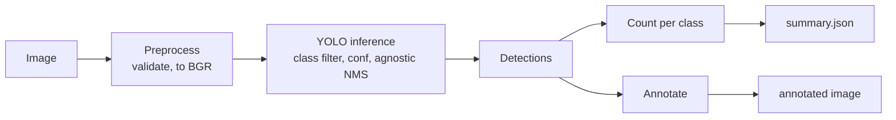
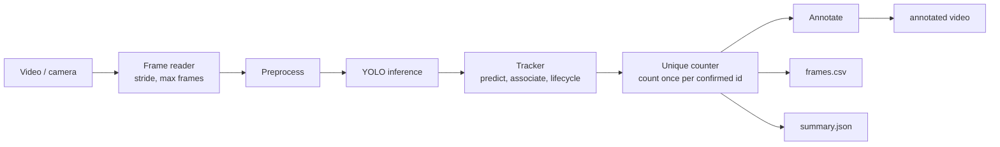

# Fruit Detection Counting

**Computer vision system for automated fruit detection and counting.**

Detects fruits in images, videos and camera streams with a YOLO model, tracks each
fruit across video frames, and reports how many *distinct* fruits were observed,
not how many boxes were drawn.


| Image: detection and per-class count | Video: tracking and unique counting |
|:---:|:---:|
|  |  |

---

## Contents

- [Why this project exists](#why-this-project-exists)
- [Features](#features)
- [Detection vs. unique counting](#detection-vs-unique-counting)
- [How it works](#how-it-works)
- [Installation](#installation)
- [Usage](#usage)
- [Configuration](#configuration)
- [Outputs](#outputs)
- [Python API](#python-api)
- [Using a custom fruit detector](#using-a-custom-fruit-detector)
- [Architecture](#architecture)
- [Testing and code quality](#testing-and-code-quality)
- [Example results](#example-results)
- [Limitations](#limitations)
- [Future work](#future-work)

## Why this project exists

Counting fruit is a basic operation in agriculture and food logistics, used for
yield estimation, harvest planning, sorting lines and inventory. Doing it by hand
is slow and error-prone, and the obvious automated approach ("run a detector on
every frame and add up the boxes") is wrong for video: a fruit that stays in view
for 100 frames would be counted 100 times.

This project is a clean, tested and extensible counting system. It treats
**detection** and **counting** as separate problems and solves the second with
multi-object tracking.

## Features

- **Fruit detection** with Ultralytics YOLO (YOLO11 by default), with configurable
  weights, device, confidence, NMS IoU, image size and class filter.
- **Unique counting in video** with a built-in multi-object tracker: Hungarian
  matching, motion prediction, two-stage (ByteTrack-style) association, and
  tentative/confirmed track lifecycles.
- **Inputs:** single images, folders of images, video files and live cameras
  (`--input 0`).
- **Outputs:** annotated images and videos, `summary.json` with counts, per-object
  statistics and the exact configuration used, and a per-frame `frames.csv`.
- **Configuration:** defaults, then YAML, then CLI flags, validated at startup.
- **Professional CLI** with a human-readable or `--json` summary, meaningful exit
  codes and optional live preview (`--show`).
- **Detector-agnostic core:** the pipeline depends on a small `Detector` protocol,
  so a custom model or runtime can be plugged in.
- **140+ behavioural tests** (unit and integration), plus Ruff and mypy.

## Detection vs. unique counting

These are two different quantities, and the system reports both:

| Metric | Question it answers | Where it appears |
|---|---|---|
| **Detection count** (`visible_count`) | How many fruits are visible *in this frame / image*? | Images: `fruit_count`. Video: per frame in `frames.csv`, "Visible now" overlay |
| **Unique count** (`unique_fruit_count`) | How many *distinct* fruits have been observed *so far*? | Video: `summary.json`, `frames.csv`, "Unique fruits counted" overlay |

For a still image the two are the same. For video they diverge quickly. In the demo
video below, the detector produced **657 boxes over 150 frames**, while the scene
contains **8 distinct detectable fruits**. The system reports 8.
`summary.json` keeps the naive total as `detections_summed_over_frames` to make the
difference visible; it is *not* a fruit count.

How a fruit is counted exactly once:

1. Each detection is associated with a **track** (an identity) across frames.
2. A new track is **tentative** until it has been matched in `min_hits` consecutive
   frames. One-frame false positives therefore never count.
3. When a track is **confirmed** it receives the next sequential id and is counted
   once. Later frames only update its statistics.
4. A confirmed track survives `max_age` frames without detections, so a fruit
   briefly hidden behind a leaf keeps its identity instead of being counted again.
5. The final class of each fruit is a **confidence-weighted vote** over its
   lifetime, which smooths frame-to-frame class flicker (for example apple vs.
   orange).

## How it works

### Image pipeline



### Video / camera pipeline



### Tracker

`FruitTracker` (`src/fruit_counter/tracking/tracker.py`) runs these steps on every
frame:

1. **Predict:** each live track is moved forward with a constant-velocity model
   (exponentially smoothed velocity on centre and size).
2. **Associate high-confidence detections** (`>= tracking.high_threshold`) with
   all tracks using the Hungarian algorithm on IoU between predicted boxes and
   detections (`>= tracking.match_iou`).
3. **Associate low-confidence detections** with the tracks still unmatched. Weak
   detections (partially occluded, blurred) keep tracks alive but can never start
   new ones, which suppresses false positives.
4. **Start tentative tracks** from unmatched high-confidence detections.
5. **Update lifecycles:** confirm after `min_hits` consecutive matches, drop
   tentative tracks on their first miss, and drop confirmed tracks after `max_age`
   misses.

I chose a small, dependency-free tracker over the tracking built into the model
library for three reasons. It works with **any** detector behind the `Detector`
protocol. It can be **unit-tested without model weights** (for example, a test
follows an accelerating fruit whose consecutive boxes overlap too little for plain
IoU matching, so only velocity prediction keeps its identity). And it makes the counting rules explicit and
configurable.

## Installation

Requirements: Python 3.10+. A GPU is optional; CPU inference works.

```bash
git clone https://github.com/felipebridge/fruit-detection-counting.git
cd fruit-detection-counting

python -m venv .venv
source .venv/bin/activate          # Windows: .venv\Scripts\activate

pip install -e ".[dev]"            # runtime + test/lint tooling
# or: pip install -e .             # runtime only
```

For NVIDIA GPUs, install the CUDA build of PyTorch first by following the
instructions at [pytorch.org](https://pytorch.org/get-started/locally/).

The default model (`models/yolo11n.pt`, COCO-pretrained, about 5 MB) is downloaded
automatically by Ultralytics on first use. Weights are never committed to Git.

## Usage

```bash
# Image
fruit-counter --input data/samples/fruit_bowl.jpg

# Folder of images (each image counted independently, totals aggregated)
fruit-counter --input path/to/images/

# Video: generate the reproducible demo clip first
python scripts/make_demo_video.py
fruit-counter --input data/samples/fruit_bowl_pan.mp4

# Webcam with live preview (press q or Esc to stop; Ctrl+C also saves partial results)
fruit-counter --input 0 --show

# Tuning
fruit-counter -i orchard.mp4 --conf 0.3 --device cuda:0 --imgsz 1280 --stride 2
fruit-counter -i orchard.mp4 --min-hits 5 --max-age 60

# Machine-readable output for scripts
fruit-counter -i data/samples/fruit_bowl.jpg --json

# Inspect which classes a model predicts
fruit-counter --list-classes --weights models/yolo11n.pt
```

`python -m fruit_counter ...` is equivalent to `fruit-counter ...`.

Example terminal output (demo video, CPU):

```text
Source:  data/samples/fruit_bowl_pan.mp4 (video)
Frames processed:      150
Unique fruits counted: 8
Max visible in frame:  8
Processing speed:      9.59 fps
  - apple: 5
  - orange: 3
Outputs: outputs/fruit_bowl_pan_20260925-210557
```

### CLI reference

| Flag | Description |
|---|---|
| `-i, --input` | Image, image directory, video file, or camera index (`0`) |
| `-c, --config` | YAML configuration file |
| `-o, --output-dir` | Root directory for run outputs (default `outputs`) |
| `--run-name` | Fixed run directory name (default `<input>_<timestamp>`) |
| `-w, --weights` | YOLO weights path |
| `--device` | `auto` (default), `cpu`, `cuda:0`, `mps` |
| `--conf`, `--iou`, `--imgsz` | Confidence threshold, NMS IoU, inference size |
| `--classes NAME ...` | Class names to keep; the bare flag keeps all classes |
| `--stride`, `--max-frames` | Process every N-th frame / stop after N frames |
| `--min-hits`, `--max-age` | Track confirmation and occlusion tolerance |
| `--show` | Live preview window |
| `--no-save-annotated` | Skip annotated images / video |
| `--json` | Print results as JSON on stdout (logs go to stderr) |
| `--list-classes` | Print the model's classes and exit |
| `--log-level` | `DEBUG`, `INFO` (default), `WARNING`, `ERROR` |

Exit codes: `0` success, `1` runtime failure (model or output), `2` invalid input or
configuration, `130` interrupted.

## Configuration

Settings are resolved in this order (later wins):

1. Defaults in `src/fruit_counter/config.py`
2. A YAML file passed with `--config` (see [`configs/default.yaml`](configs/default.yaml),
   which documents every option)
3. CLI flags

```yaml
model:
  weights: models/yolo11n.pt
  device: auto
  confidence: 0.25
  iou: 0.45
  classes: [apple, banana, orange]
tracking:
  high_threshold: 0.5
  match_iou: 0.3
  min_hits: 3
  max_age: 30
```

All values are validated when they are loaded. Unknown keys, out-of-range
thresholds and image sizes that aren't multiples of 32 fail
immediately with a clear message.

## Outputs

Every run gets its own directory, so results never overwrite each other:

```text
outputs/
└── fruit_bowl_pan_20260925-210146/
    ├── summary.json                    # counts, per-object stats, config, metadata
    ├── fruit_bowl_pan_annotated.mp4    # video/camera: boxes, track ids, live counts
    └── frames.csv                      # video/camera: per-frame statistics
```

For images the run contains `<name>_annotated.<ext>` and `summary.json` with every
detection (class, confidence, box). An abridged `summary.json` for a video run:

```json
{
  "tool": { "name": "fruit-detection-counting", "version": "0.1.0" },
  "source": { "kind": "video", "location": "data/samples/fruit_bowl_pan.mp4" },
  "config": { "...": "full resolved configuration" },
  "results": {
    "frames_processed": 150,
    "unique_fruit_count": 8,
    "counts_by_class": { "apple": 5, "orange": 3 },
    "max_visible_in_frame": 8,
    "mean_visible_per_frame": 4.38,
    "detections_summed_over_frames": 657,
    "objects": [
      { "track_id": 1, "class_name": "orange", "first_frame": 2, "last_frame": 97,
        "observations": 96, "mean_confidence": 0.8505 }
    ],
    "processing_fps": 8.41,
    "interrupted": false
  }
}
```

`frames.csv` columns: `frame_index, timestamp_s, visible_count, tracked_count,
unique_count, new_ids, inference_ms`.

## Python API

```python
from fruit_counter import FruitCountingRunner, load_config, resolve_source

config = load_config("configs/default.yaml", overrides={"model": {"device": "cpu"}})
report = FruitCountingRunner(config).run(resolve_source("orchard.mp4"))
print(report.fruit_count, report.results["counts_by_class"], report.output_dir)
```

For in-memory frames (for example behind a web service), use the pipelines
directly:

```python
from fruit_counter import VideoPipeline, YoloDetector, load_config

config = load_config()
pipeline = VideoPipeline(YoloDetector(config.model), config.tracking)
for frame in frames:  # numpy BGR arrays from any source
    result = pipeline.process_frame(frame)
    print(result.visible_count, result.unique_count)
print(pipeline.summary().to_dict())
```

## Using a custom fruit detector

The default checkpoint is trained on **COCO**, which has only three fruit classes:
**apple, banana and orange**. Other fruits are either missed or mislabelled as the
closest COCO class. In the sample photo, for example, lemons are detected as
"apple" and limes are not detected at all.

For other fruits, or for dense orchard scenes with small fruit, train a detector on
a fruit dataset with Ultralytics and plug it in without code changes:

```bash
fruit-counter -i orchard.mp4 --weights models/my_fruit_model.pt --classes
```

`--classes` with no names (or `classes: []` in YAML) keeps every class the model
predicts. Use `--list-classes` to check a model's labels. Any other backend (ONNX
Runtime, TensorRT, a remote service) can be integrated by implementing the two-member
`Detector` protocol in `src/fruit_counter/detector.py`.

## Architecture

```text
fruit-detection-counting/
├── configs/default.yaml          # documented default configuration
├── data/samples/                 # CC0 sample image (+ attribution); generated videos are ignored
├── docs/assets/                  # README media
├── models/                       # model weights (git-ignored)
├── scripts/make_demo_video.py    # reproducible demo video generator
├── src/fruit_counter/
│   ├── cli.py                    # argument parsing, exit codes, report formatting
│   ├── runner.py                 # application layer: sources -> pipelines -> outputs
│   ├── config.py                 # typed, validated, layered configuration
│   ├── sources.py                # input resolution, image/video/camera reading
│   ├── outputs.py                # run directories, JSON/CSV/image/video writers
│   ├── preprocessing.py          # frame validation and normalisation
│   ├── detector.py               # Detector protocol and Ultralytics YOLO adapter
│   ├── tracking/
│   │   ├── matching.py           # Hungarian assignment on IoU
│   │   └── tracker.py            # motion prediction, association, track lifecycle
│   ├── counting.py               # per-frame counts and unique counting
│   ├── pipeline/
│   │   ├── image.py              # stateless image pipeline
│   │   └── video.py              # streaming video pipeline
│   ├── visualization.py          # boxes, labels, ids, summary panel
│   ├── structures.py             # BoundingBox, Detection, TrackedDetection, IoU
│   └── exceptions.py             # error hierarchy
└── tests/                        # unit + integration tests
```

Design decisions:

- **Layered and dependency-directed.** `cli` → `runner` → `pipeline` →
  `detector` / `tracking` / `counting` → `structures`. Only `detector.py`
  imports Ultralytics, and it does so lazily, so importing the package does not
  load PyTorch.
- **Pipelines are pure and in-memory.** They take numpy frames and return result
  objects. All file I/O lives in `sources`, `outputs` and `runner`, so the same
  pipelines can serve a CLI, a batch job or a web API.
- **Streaming by design.** Frames are processed one at a time, and per-frame
  statistics are streamed to CSV, so long videos and camera feeds don't accumulate
  in memory. Ctrl+C still writes the partial results.
- **Fail early with actionable errors.** Configuration and inputs are validated
  before the model is loaded, and every expected failure raises a
  `FruitCounterError` subclass that the CLI maps to an exit code.
- **Class-agnostic NMS by default.** With per-class NMS, an ambiguous fruit can
  produce overlapping "apple" and "orange" boxes that become two tracks. This was
  found on the demo video and fixed (a 9 → 8 double count).

## Testing and code quality

```bash
pytest                    # full suite (the slow real-model test runs if weights are present)
pytest -m "not slow"      # skip real inference
ruff check . && ruff format --check .
mypy
```

What is tested:

- **Configuration:** precedence and rejection of invalid values.
- **Tracker:** confirmation, 100-frame persistence with a single id, occlusion
  bridging, expiry and re-identification, false-positive suppression, low-confidence
  track extension, and a velocity-prediction scenario that fails without
  prediction.
- **Counting:** each id is counted once, tentative tracks are never counted, and
  class voting is applied.
- **Pipelines:** detection count vs. unique count with scripted detectors.
- **I/O and integration:** end-to-end runs on real image and video files (written
  and read back with OpenCV), directory runs with corrupt files, stride/max-frames,
  Ctrl+C partial results, and CLI exit codes and JSON output.
- **Model:** the YOLO adapter against a fake model, plus a real YOLO11n inference
  test on the sample image (marked `slow`).

## Example results

These numbers come from running the unmodified pipeline with the default
configuration (YOLO11n, CPU) on the repository's sample data. They are
**illustrative, not a benchmark**: no labelled evaluation dataset is used, so no
accuracy metrics are claimed.

| Input | Result |
|---|---|
| `fruit_bowl.jpg` (9 fruits: 3 oranges, 1 apple, 2 lemons, 3 limes) | **6 detected**: 3 × orange, 3 × apple (the 2 lemons are labelled apple; the limes are missed, as COCO has no lemon/lime class) |
| `fruit_bowl_pan.mp4` (150 frames, 800×450, camera pan) | **8 unique fruits** from 657 per-frame detections. Each of the 8 physically distinct fruits the detector sees keeps one id; the 9th fruit (a lime) is never detected |

On a laptop CPU (AMD Ryzen, no GPU), the video runs processed 8–10 frames per
second end to end (inference, tracking, annotation and encoding). The first frame
includes model warm-up.

## Limitations

- **Class coverage:** COCO-pretrained weights know only apple, banana and orange
  (see [custom detector](#using-a-custom-fruit-detector)).
- **Counting accuracy is bounded by detection:** fruit that is never detected is
  never counted.
- **Identity fragmentation:** a fruit hidden for longer than `max_age` frames, or
  one that leaves and re-enters the view, gets a new id and is counted again. No
  appearance-based re-identification is used.
- **Cold start on very fast motion:** a new track has no velocity estimate yet, so
  an object that moves most of its own width per frame when it first appears may
  not be linked. This is shared with Kalman-based trackers and is covered by a test.
- **Video codec:** annotated videos use `mp4v`, which some browsers can't play
  inline. Re-encode with ffmpeg if needed.

## Future work

Not implemented in the current version:

- **Ripeness / maturity and quality classification.** The intended extension is a
  per-detection classification stage between detection and counting, with results
  aggregated per track the same way class votes are.
- Training and publishing a dedicated fruit detector, with a proper evaluation
  (mAP for detection; counting error against annotated videos).
- Line or zone crossing counts for conveyor belts and orchard rows.
- Appearance-based re-identification to reduce double counting after long
  occlusions.
- Model export (ONNX/TensorRT) and a REST API around the existing pipelines.
- Continuous integration (lint, types and tests on every push).

## Acknowledgements and licensing

- Detection models: [Ultralytics YOLO](https://github.com/ultralytics/ultralytics)
  (AGPL-3.0). Take its license into account when you distribute this project or
  derived work.
- Sample image: *Fruits in bowl oranges lime apples (1).jpg*, Wikimedia Commons,
  CC0. See [`data/samples/ATTRIBUTION.md`](data/samples/ATTRIBUTION.md).
- The project itself does not ship a license file yet.
