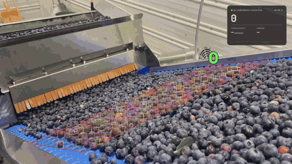

<div align="center">

# Fruit Detection & Counting

**Real-time fruit detection, tracking and counting from images, video and live camera feeds.**



[](https://github.com/felipebridge/fruit-detection-counting/actions/workflows/ci.yml)


[](https://github.com/astral-sh/ruff)
[](https://mypy-lang.org/)
[](https://docs.pytest.org/)
[](LICENSE)

</div>

Combines YOLO11 detection with multi-object tracking so each fruit is counted exactly once, reporting unique fruit rather than per-frame detections.

## Quick Start

```bash
git clone https://github.com/felipebridge/fruit-detection-counting.git
cd fruit-detection-counting
pip install -e .
fruit-counter            # processes every video in videos_to_processing/
```

Results go to `outputs/<video>_<timestamp>/`: an annotated H.264 video, `summary.json` and `frames.csv`.
Install [ffmpeg](https://ffmpeg.org/download.html) for H.264 output with audio.

```bash
fruit-counter -i fruit_bowl.jpg                     # image or folder
fruit-counter -i orchard.mp4 --device cuda:0        # video on a GPU
fruit-counter -i 0 --show                           # webcam
fruit-counter -i video.mp4 --weights my_model.pt    # your own model
```

Settings live in [`configs/default.yaml`](configs/default.yaml); see `fruit-counter --help`.

## How It Works

**Detect** (YOLO11, class-agnostic NMS) → **Track** (constant-velocity + Hungarian IoU matching) → **Count** (once per confirmed track, label by confidence-weighted vote) → **Render**.

## License

[MIT](LICENSE) © felipebridge. Powered by [Ultralytics YOLO](https://github.com/ultralytics/ultralytics) (AGPL-3.0). Contributions welcome, see [CONTRIBUTING.md](CONTRIBUTING.md).
