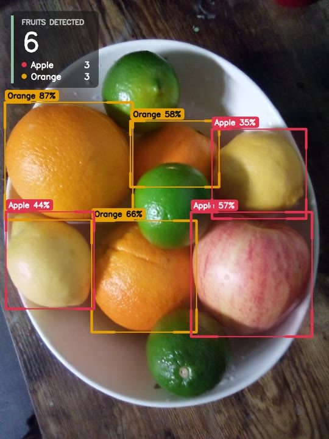
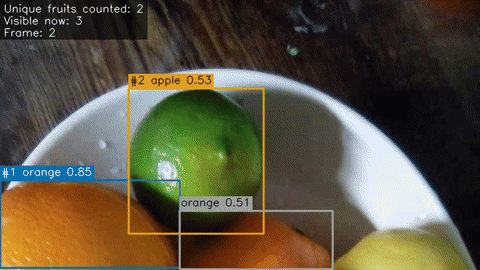

# Fruit Detection & Counting

Detects fruit in images and videos with an Ultralytics YOLO model and counts it.

- **Images:** the count is the number of fruits detected in the image.
- **Videos / cameras:** each fruit is tracked across frames and counted once, so a
  fruit that stays in view for 100 frames counts as one, not 100.

| Image: detection and per-class count | Video: tracking and unique counting |
|:---:|:---:|
|  |  |

## Installation

Requires Python 3.10+. A GPU is optional.

```bash
git clone https://github.com/felipebridge/fruit-detection-counting.git
cd fruit-detection-counting
python -m venv .venv
source .venv/bin/activate       # Windows: .venv\Scripts\activate
pip install -e .                # add ".[dev]" for pytest, ruff and mypy
```

For CUDA, install the matching PyTorch build first ([pytorch.org](https://pytorch.org/get-started/locally/)).

## Model

The default weights are `models/yolo11n.pt`, the official COCO-pretrained YOLO11n
checkpoint (~5 MB). Ultralytics downloads it on first use; weights are not committed.

COCO has only three fruit classes: **apple, banana and orange**. Other fruits are
missed or labelled as the closest of those three. For other fruit, train a detector
on your own dataset with Ultralytics (no dataset or training code is included here)
and pass its weights:

```bash
fruit-counter -i orchard.mp4 --weights models/my_fruit_model.pt --classes
fruit-counter --list-classes --weights models/my_fruit_model.pt
```

`--classes` with no names keeps every class the model predicts, which is what you want
for a fruit-only model. Class names that the model doesn't have are rejected at startup.

## Usage

```bash
fruit-counter -i data/samples/fruit_bowl.jpg        # image
fruit-counter -i path/to/images/                    # every image in a folder
python scripts/make_demo_video.py                   # create the demo clip
fruit-counter -i data/samples/fruit_bowl_pan.mp4    # video
fruit-counter -i 0 --show                           # webcam, live preview (q/Esc to stop)
fruit-counter -i orchard.mp4 --conf 0.3 --device cuda:0 --stride 2
```

`python -m fruit_counter` works the same way. Run `fruit-counter --help` for all flags.

Output for the demo video:

```text
Source: data/samples/fruit_bowl_pan.mp4 (video)
Frames processed:      150
Unique fruits counted: 8
Max visible in frame:  8
Processing speed:      13.52 fps
  - apple: 5
  - orange: 3
Outputs: outputs/fruit_bowl_pan_20260926-121045
```

Exit codes: `0` success, `1` model or output failure, `2` invalid input or
configuration, `130` interrupted. Ctrl+C during a video still writes the partial results.

### Outputs

Each run writes to its own directory, `outputs/<input>_<timestamp>/`:

- `summary.json`: counts per class, the configuration used, and either every
  detection (images) or per-fruit statistics (video: track id, class, first/last
  frame, mean confidence).
- `<input>_annotated.jpg` / `.mp4`: boxes, labels, track ids and counts
  (skip with `--no-save-annotated`).
- `frames.csv` (video only): visible, tracked and cumulative unique count per frame.

For video, `summary.json` also reports `detections_summed_over_frames`, the naive
per-frame total (657 on the demo clip). It is there for comparison and is not a count.

## How video counting works

`src/fruit_counter/tracker.py` associates detections across frames:

1. Each track's box is moved forward with a constant-velocity estimate.
2. Detections with confidence >= `high_threshold` are matched to tracks by IoU
   (Hungarian algorithm). Weaker detections can only extend existing tracks, never
   start one.
3. A new track is confirmed, and the fruit counted, after `min_hits` consecutive
   matches, so one-frame false positives are never counted.
4. A confirmed track survives `max_age` frames without detections, so a briefly
   hidden fruit keeps its id.
5. Each fruit's class is a confidence-weighted vote over its whole track.

NMS runs across classes, so one fruit can't produce both an "apple" and an "orange"
box and be counted twice.

`min_hits` and `max_age` count processed frames, so with `--stride 2` the default
`max_age` of 30 covers 60 frames of the source video.

## Configuration

Defaults can be overridden with a YAML file (`-c`), and CLI flags override both.
[`configs/default.yaml`](configs/default.yaml) lists every option:

| Section | Keys |
|---|---|
| `model` | `weights`, `device`, `image_size`, `confidence`, `iou`, `classes`, `half` |
| `tracking` | `high_threshold`, `match_iou`, `min_hits`, `max_age` |
| `video` | `frame_stride`, `max_frames` |
| `output` | `directory`, `save_annotated` |

## Speed

Almost all of the time goes to the network. On a laptop CPU, YOLO11n takes about
56 ms per 800x450 frame, and the rest of the pipeline adds about 4 ms (decoding,
tracking, drawing and encoding). To go faster, use a GPU (`--device cuda:0`, and
`half: true` in the config), process fewer frames (`--stride`), use a smaller
`--imgsz`, or skip the annotated output (`--no-save-annotated`).

## Code layout

| Module | Role |
|---|---|
| `detector.py` | YOLO inference, class filter, conversion to `Detection` |
| `tracker.py` | IoU tracker with motion prediction |
| `counting.py` | Per-image counts and unique counting from track ids |
| `pipeline.py` | In-memory image and video pipelines |
| `runner.py` | Reads the input, runs a pipeline and writes the outputs |
| `evaluation.py` | Counting error against ground truth |
| `sources.py`, `visualization.py`, `config.py`, `cli.py` | Input, drawing, settings, CLI |

## Python API

```python
from fruit_counter import FruitCountingRunner, load_config, resolve_source

config = load_config(overrides={"model": {"device": "cpu"}})
report = FruitCountingRunner(config).run(resolve_source("orchard.mp4"))
print(report.fruit_count, report.results["counts_by_class"])
```

To process frames you already have in memory:

```python
from fruit_counter import VideoPipeline, YoloDetector, load_config

config = load_config()
pipeline = VideoPipeline(YoloDetector(config.model), config.tracking)
for frame in frames:  # BGR numpy arrays
    pipeline.process_frame(frame)
print(pipeline.summary()["unique_fruit_count"])
```

## Measuring counting error

Given the true counts, `--ground-truth` reports how far off the counts are. The CSV
needs `file` and `count` columns, where `file` is the image or video file name:

```csv
file,count
IMG_0001.jpg,14
row3.mp4,212
```

```bash
fruit-counter -i path/to/images/ --ground-truth counts.csv
```

`summary.json` then contains the error per file (predicted minus true), the mean
absolute error and the mean error (negative means undercounting). Files without a
ground-truth entry are listed and skipped. The input is checked against the CSV
before the model is loaded.

## Example results

Default configuration (YOLO11n, CPU) on the sample data, evaluated with
`data/samples/counts.csv`. The sample bowl has 9 fruits: 3 oranges, 1 apple, 2 lemons
and 3 limes. This is one hand-labelled example, not a benchmark.

| Input | Predicted | True | Notes |
|---|---|---|---|
| `fruit_bowl.jpg` | 6 | 9 | The 3 oranges and the apple are found, the 2 lemons are labelled "apple", and the 3 limes are missed. |
| `fruit_bowl_pan.mp4` (150-frame pan) | 8 | 9 | 657 per-frame detections are reduced to 8 unique fruits (5 apple, 3 orange). |

## Limitations

- The default model only knows apple, banana and orange (see [Model](#model)).
- A fruit that is never detected is never counted.
- A fruit hidden for more than `max_age` frames, or one that leaves and re-enters the
  view, gets a new id and is counted again. There is no appearance-based
  re-identification.
- A new track has no velocity estimate yet, so a fruit that moves most of its own
  width per frame when it first appears may not be linked across frames.
- Annotated videos use the `mp4v` codec, which some browsers can't play inline.

## Development

```bash
pip install -e ".[dev]"
pytest                    # includes one real-inference test if models/yolo11n.pt exists
pytest -m "not slow"      # skip it
ruff check . && ruff format --check . && mypy
```

## License

The project itself has no license file yet. Detection uses
[Ultralytics YOLO](https://github.com/ultralytics/ultralytics) (AGPL-3.0). The sample
image is CC0; see [`data/samples/ATTRIBUTION.md`](data/samples/ATTRIBUTION.md).
